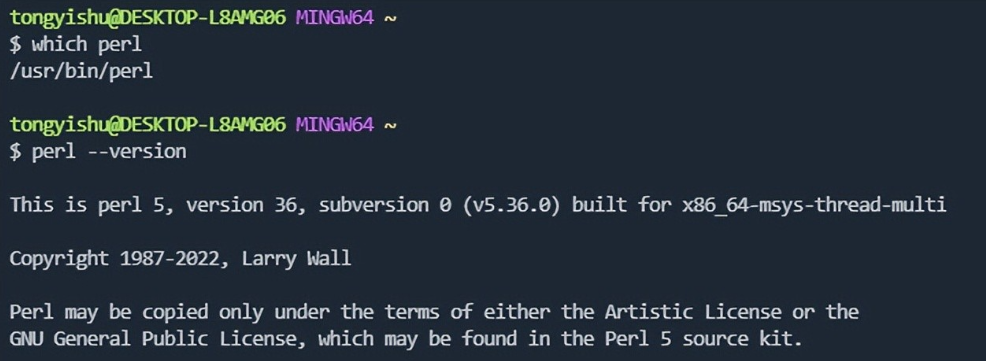

# 如何使用checkpatch.pl

checkpatch.pl是用Perl语言编写的脚本程序，用于内核代码的CodingStyle的检查和格式化。checkpatch.pl位于内核代码的scripts目录，因此可以从内核代码中找到并下载该脚本：

https://github.com/torvalds/linux/blob/v5.19/scripts/checkpatch.pl

windows下的使用方法如下（需要提前安装好Perl解释器）：



1、将checkpatch.pl下载并拷贝到git-bash的/usr/bin/目录下

```bash
  cp checkpatch.pl /usr/bin/
```

2、给checkpatch.pl添加可执行权限

```bash
  chmod +x /usr/bin/checkpatch.pl
```

3、使用checkpatch.pl检查代码格式

```bash
  checkpatch.pl --no-tree --strict -f ./lib/util/source/rax.c
```

4、使用checkpatch.pl格式化代码

```bash
  checkpatch.pl --no-tree --strict --fix-inplace -f ./lib/util/source/rax.c
```

# 常用选项说明

--no-tree 不检测整个目录树

--fix-inplace 修复并替换文件

--fix 修复但不替换原文件，会在原文件的目录下产生一个修复后的新文件

-f 指定c文件

--strict 更加严格的检测

具体使用可参考：https://www.kernel.org/doc/html/latest/dev-tools/checkpatch.html
