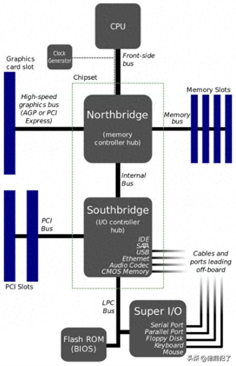
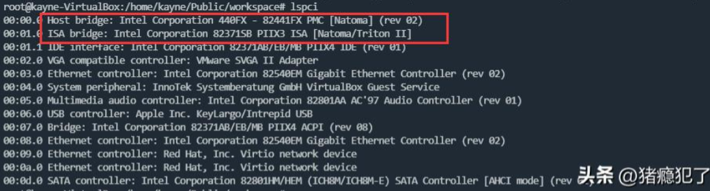
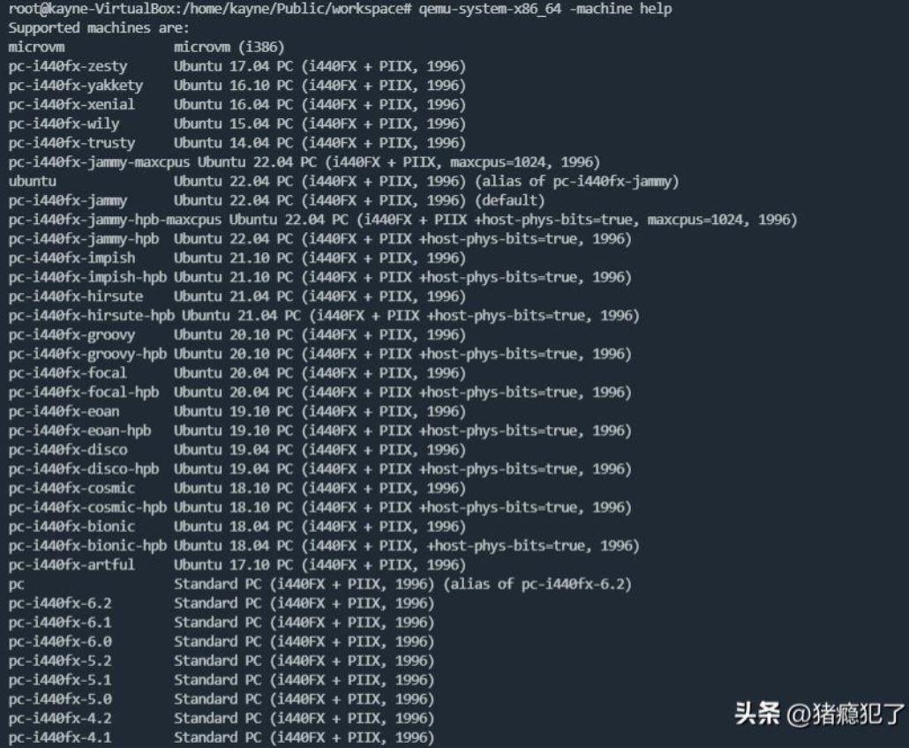

# 什么是南北桥

计算机南北桥是指计算机的南桥芯片和北桥芯片，常见于早期的的计算机系统（1990年 \~ 2000年）。

* 北桥（North Bridge）又称为系统控制器，它连接到处理器（CPU）并管理系统内存（RAM）、高速系统总线（PCI）、AGP（加速图形端口）以及其他高速设备。北桥的性能直接影响系统的整体性能。
* 南桥（South Bridge）又称为I/O控制器，它连接到北桥并负责处理I/O操作，连接硬盘驱动器、USB接口、声卡、网卡等慢速外围设备。南桥处理的是相对较慢的数据传输和管理任务。

# 南北桥的典型

QEMU Standard PC（x86），I440FX + PIIX3

I440FX 和 PIIX3 经常一起使用，构成了早期x86架构计算机的主要芯片组组合。I440FX是北桥芯片，负责处理系统总线和内存控制，而PIIX是南桥芯片，负责处理I/O接口和外围设备控制。这两个芯片共同提供了早期计算机所需的基本功能和性能。

QEMU中可以通过-machine选项指定使用的架构：

