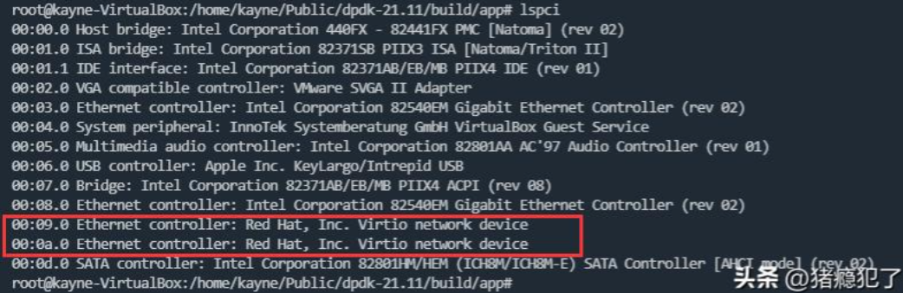
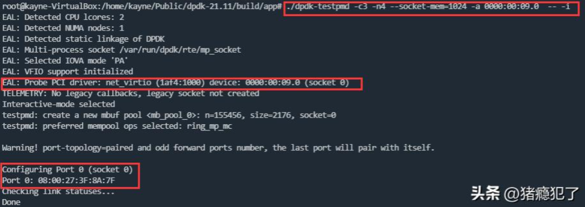
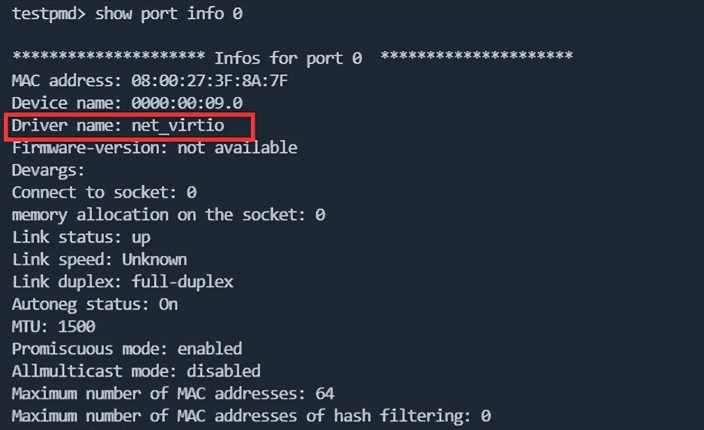

使用VirtualBox虚拟出来了两个virtio-net设备，现在考虑用dpdk-testpmd接管这两个网卡。



从dpdk源码（21.11版本）的
`drivers/net/virtio/virtio_pci_ethdev.c`文件中可以发现，接管virtio-net设备的driver为`net_virtio`，该driver依赖于kernel module：`igb_uio | uio_pci_generic | vfio-pci`，三者任选其一即可。

这里我选择igb_uio，需要提前下载dpdk-kmod源码进行编译，编译后会生成igb_uio.ko。拉起dpdk-testpmd的步骤如下：

1、由于igb_uio依赖kernel的uio模块（一般内核会自带），需要先加载uio模块：

```bash
modprobe uio
```

2、其次加载编译的igb_uio模块（进到igb_uio.ko所在的目录）：

```bash
insmod ./igb_uio.ko
```

3、查看加载的结果（二者均被加载）：

```bash
lsmod | grep uio
```

4、启动dpdk-testpmd

```bash
./dpdk-testpmd -c3 -n4 --socket-mem=1024 -a 0000:00:09.0 -- -i
```



5、查看端口信息：

```bash
testpmd>show port info 0
```


