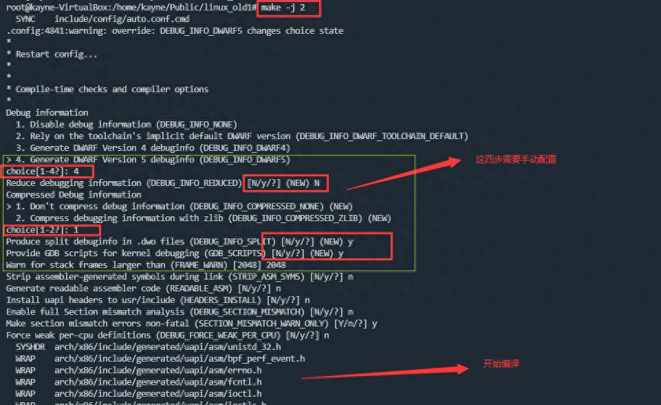
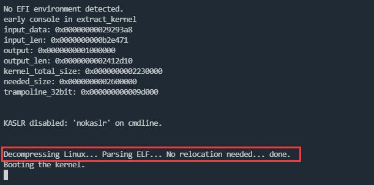
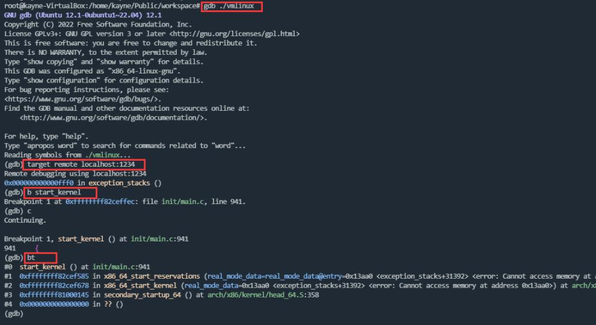

# 内核编译时加上debug信息

要想使用gdb调试内核，在编译内核时需要先打开内核的debug信息，这里我调试的v6.2的内核，make defconfig后直接修改内核配置文件.config：

```bash
CONFIG_DEBUG_INFO_DWARF5=y
```

make -j 编译时会提示重新配置相关选项，一步步往下走即可：



# 使用qemu拉起内核

```bash
qemu-system-x86_64 -kernel ./bzImage -initrd ./initramfs.cpio -append "nokaslr console=ttyS0 loglevel=7 debug earlyprintk=serial,ttyS0,115200" -nographic -s -S
```

-append 是内核启动参数:

* nokaslr表示禁用KASLR功能，内核地址空间布局随机化 (Kernel Address Space Layout Randomization, KASLR) 是一种安全机制，它通过随机化内核的加载地址来防止某些类型的攻击。在调试内核时，KASLR会导致符号地址解析不一致，从而导致gdb断不到已打的断点，因此在调试时可以禁用KASLR功能
* console=ttyS0表示将内核的输出重定向到ttyS0串口
* loglevel=7表示日志级别为debug级别，这是最详细的日志级别，包括所有的调试消息
* debug表示启用debug_info代码调试信息
* earlyprintk=serial,ttyS0,115200表示早期的printk打印重定向到ttyS0这个串口，波特率为115200

**-nographic** 禁用图形化界面

**-s** 启动gdb服务器，默认使用tcp协议和1234端口，等价于-gdb tcp::1234

**-S** 启动时不拉起虚机的CPU，等待gdb连接

**-kernel** 指定内核镜像

**-initrd** 指定文件系统



# 使用gdb调试内核

```bash
gdb ./vmlinux
(gdb) target remote localhost:1234
(gdb) b start_kernel
(gdb) c
(gdb) bt
```

**gdb ./vmlinux** ，内核编译完成后，在生成bzImage的同时，还会生成一个vmlinux的ELF文件，该文件包含了内核程序及其调试信息，我们需要使用该文件进行调试，让gdb加载符号表及debug_info。准确的说，bzImage是vmlinux剥离调试信息后再压缩的结果

**target remote :1234** ，连接gdb server，qemu在拉起时会指定-s选项，该选项会启动一个gdb server

**b start_kernel** 打断点

**c** 连接上gdb server后，让内核继续运行

**bt** 打印调用栈



然后就可以对着代码，单步调试了。
