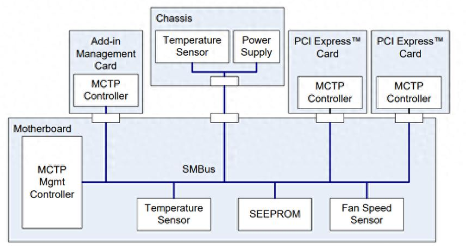

MCTP （Management Component Transport Protocol），管理组件传输协议，主要用于计算机系统中的基板管理控制器（BMC）。



**MCTP是一种"总线无关"协议，可建立在多种总线之上（SMbus/I2C/PCIe/USB/SPI）：**

- MCTP over SMbus，System Management Bus

- MCTP over I2C，Inter-Integrated Circuit

- MCTP over PCIe VDM，PCI Express Virtual Direct Media Interface

- MCTP over USB，Universal Serial Bus

- MCTP over SPI，Serial Peripheral Interface

**MCTP也可作为多种协议载体（NC-SI/PLDM/NVMe-MI/Ethernet）：**

- NC-SI over MCTP，Network Controller Sideband Interface

- PLDM over MCTP，Platform Level Data Model

- NVMe-MI over MCTP，NVMe Management Interface

- Ethernet over MCTP，Ethernet Protocol

**MCTP协议格式如下：**

```bash
+--------+--------+-----------------+-----------------+----------------+
|  RSVD  |VERSION |      DEID       |       SEID      |SOM|EOM|PS|TO|MT|
+--------+--------+-----------------+-----------------+----------------+
   4bit     4bit         8bit              8bit              8bit
```

- RSVD：Reserved，4bit

- VERSION：Header version，4bit

- DEID：Destination Endpoint ID，8bit

- SEID：Source Endpoint ID，8bit

- SOM：Start of Message，1bit

- EOM：End of Message，1bit

- PS：Packet Sequence，2bit

- TO：Tag Owner，1bit

- MT：Message tag，3bit
