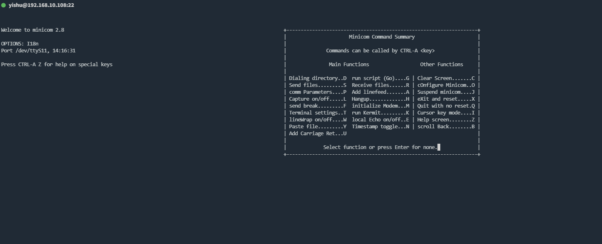
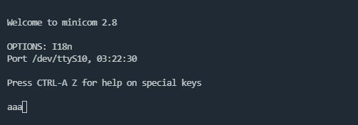

# minicom启动参数

-b, --baudrate 指定波特率

-D, --device 指定设备

-c, --color=on/off 开启/关闭颜色

-C 启动时自动创建日志文件，minicom的所有输出都保存在该文件中

-v 查看版本信息

eg. minicom -D /dev/ttyS0

eg. minicom -c on -D /dev/ttyS0

# minicom基本操作



Ctrl + A, Z 进入帮助界面，再根据提示可进行配置更改

Ctrl + A, X 退出minicom

# 使用minicom接管串口

1、使用socat创建一对串口，分别连接/dev/ttyS10和/dev/ttyS11设备

```bash
socat -d -d pty,link=/dev/ttyS10,raw,echo=0 pty,link=/dev/ttyS11,raw,echo=0
```

2、使用minicom分别接管两个串口设备（起两个终端分别执行）

```bash
minicom -D /dev/ttyS10
minicom -D /dev/ttyS11
```

3、在其中一个minicom终端进行输入，另一个minicom终端上有对应的输出


