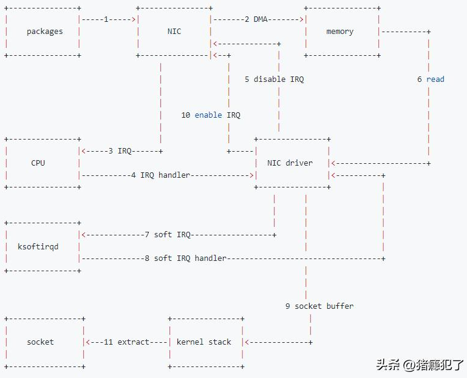

# 报文进入网卡后的处理流程

1、数据包进入物理网卡，如果目的地址不是该网络设备，且该网络设备没有开启混杂模式，该包会被该网络设备丢弃。

2、物理网卡将数据包通过 DMA 的方式写入到指定的内存地址，该地址由网卡驱动分配并初始化。

3、物理网卡通过硬件中断（IRQ）通知 CPU，有新的数据包到达物理网卡需要处理。

4、CPU 根据中断表，调用已经注册了的中断函数，该中断函数会调用驱动程序（NIC Driver）中相应的函数。

5、驱动先禁用网卡的中断，表示驱动程序已经知道内存中有数据了，告诉物理网卡下次再收到数据包直接写内存就可以了，不要再通知 CPU 了，这样可以提高效率，避免 CPU 不停地被中断。

6、从内存中读取要处理的数据。

7、启动软中断继续处理数据包。这样做的原因是硬中断处理程序执行的过程中不能被中断，所以如果它执行时间过长，会导致 CPU 没法响应其它硬件的中断，于是内核引入软中断，将硬中断处理函数中耗时的部分移到软中断处理函数里面来慢慢处理。

8、将处理结果返回给网卡驱动。

9、网卡驱动将处理后的数据通过socket buffer的形式传递给内核协议栈。

10、网卡驱动使能网卡的硬件中断。

11、内核协议栈进行网络层的报文解析后，将提取后的数据通过socket的形式传递给APP进程。
