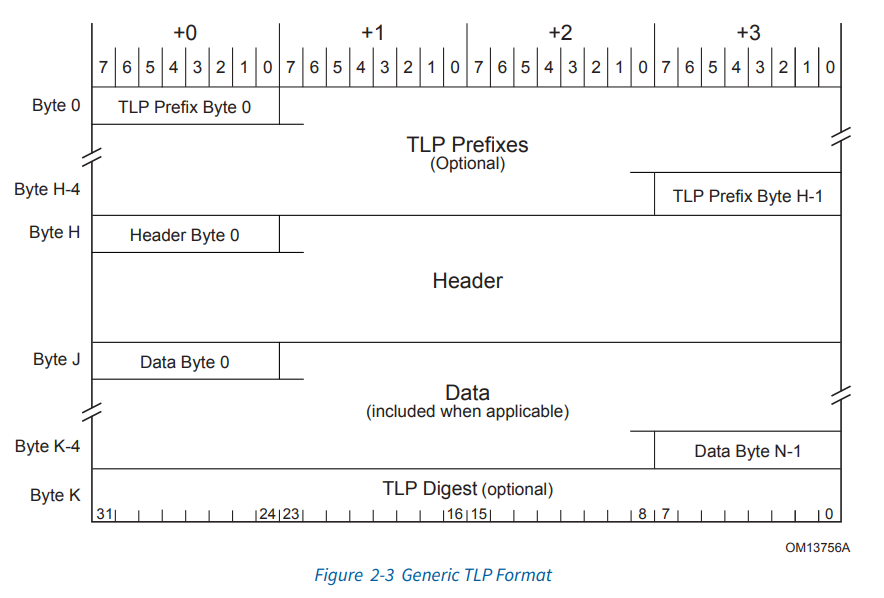
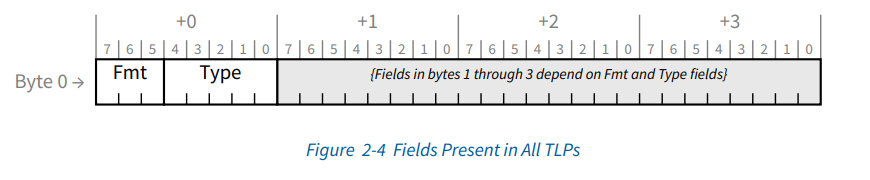
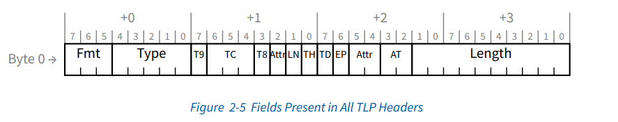

# TLP的报文格式

PCIe事务分为两种：

* 请求 - Request
* 响应 - Completion。

Request和Completion都由TLP（Transaction Layer Packet）数据包构成，TLP数据包的通用格式如上，由一个或多个可选的TLP前缀（TLP Prefix）、一个TLP头部（TLP Header）、一个数据有效载荷（TLP Data，只有某些类型的数据包才有该段）、以及一个可选的TLP校验值（TLP Digest）构成。

所有的TLP Prefix和TLP Header都包含以下字段：

# TLP Header的格式

Fmt字段：

| Fmt[2:0] | Corresponding TLP Format |
| ---------- | -------------------------- |
| 000      | 3 Dw header, no data     |
| 001      | 4 Dw header, no data     |
| 010      | 3 DW header, with data   |
| 011      | 4 Dw header, with data   |
| 100      | TLP Prefix               |

Type字段：

| TLP Type | Fmt [2:0] | Type [4:0] | Description                                          |
| ---------- | ----------- | ------------ | ------------------------------------------------------ |
| MRd      | 000/001   | 0 0000     | 内存读请求                                           |
| MRdLk    | 000/001   | 0 0001     | 带锁的内存读请求                                     |
| MWr      | 010/011   | 0 0000     | 内存写请求                                           |
| IORd     | 000       | 0 0010     | I/O 读请求                                           |
| IOWr     | 010       | 0 0010     | I/O 写请求                                           |
| CfgRd0   | 000       | 0 0100     | 非桥设备（Endpoint, type 0）配置读请求               |
| CfgWr0   | 010       | 0 0100     | 非桥设备（Endpoint, type 0）配置写请求               |
| CfgRd1   | 000       | 0 0101     | 桥设备（Switch, type 1）配置读请求                   |
| CfgWr1   | 010       | 0 0101     | 桥设备（Switch, type 1）配置写请求                   |
| TCfgRd   | 000       | 1 1011     | 已废弃                                               |
| TCfgWr   | 010       | 1 1011     | 已废弃                                               |
| Msg      | 001       | 1 0xxx     | 消息请求，xxx 指定消息的路由机制                     |
| MsgD     | 011       | 1 0xxx     | 带载荷的消息请求，xxx 指定消息的路由机制             |
| Cpl      | 000       | 0 1010     | 不带载荷的响应                                       |
| CplD     | 010       | 0 1010     | 带载荷的响应                                         |
| CplLk    | 000       | 0 1011     | 不带载荷的响应，用于应答带锁读的请求                 |
| CplDLk   | 010       | 0 1011     | 带载荷的响应，用于应答带锁读的请求                   |
| FetchAdd | 010/011   | 0 1100     | 读取并累加的原子操作请求                             |
| Swap     | 010/011   | 0 1101     | 无条件交换的原子操作请求                             |
| CAS      | 010/011   | 0 1110     | 比较并交换的原子操作请求                             |
| LPrfx    | 100       | 0 xxxx     | 本地 TLP Prefix，xxxx 指定本地 TLP Prefix 的类型     |
| EPrfx    | 100       | 0 xxxx     | 端到端 TLP Prefix，xxxx 指定端到端 TLP Prefix 的类型 |

TC，Traffic Class，流量类型，用于指定流量的优先级

TD，TLP Digest，TLP消息摘要，用于检测数据是否损坏

EP，Error Poisoned，传输错误标记

TH，表示当前TLP是否包含TPH（TLP Processing Hints，事务处理提示）信息

AT，与PCIe总线的地址转换相关，在一些PCIe设备中设置了ATC（Address Translation Cache）部件，该部件的主要功能是进行存储器域和PCI域地址转换

Atrr，由3Bit组成：Bit2表示TLP是否支持PCIe总线的ID-based Ordering；Bit1表示TLP是否支持Relaxed Ordering；Bit0表示该TLP在经过RC到达存储器时，是否要进行Cache共享一致性处理

Length，有效载荷的长度，以DW（4字节）为单位
