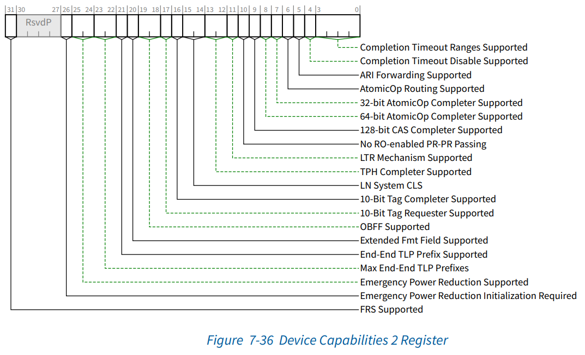
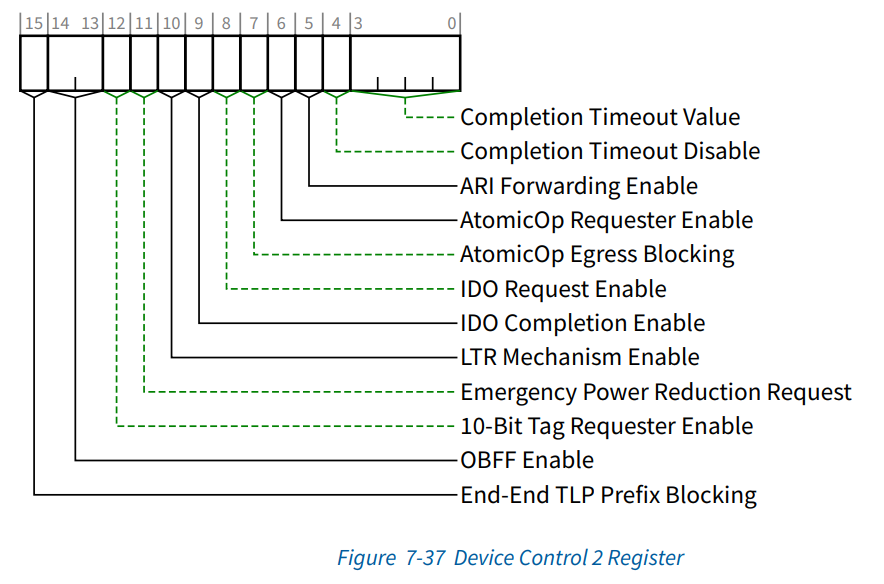

PCIe设备发出的请求中，有些需要Completer反馈Completion，此时Requester会等待Completion再进行下一步操作。在某些情况下，比如配置不当或系统故障等，Requester无法收到或齐Completion。为了不影响进一步的使用，需要一种超时退出机制让Requester从这种等待状态中恢复过来，这就是Completion Timeout机制（完成超时退出机制）。

PCIe中与该机制相关的两个寄存器：Device Capabilities 2 Register（简称DevCap2）和Device Control 2 Register（简称DevCtl2）。其中DevCap2展示了Device支持的超时能力，真正的超时配置是下发到DevCtl2中。软件可以通过setpci命令修改DevCtl2寄存器，从而修改PCIe设备的Completion超时时间。

# Express Root Port Capability

RP端口设备能力，只有RP或RC设备才具备该能力。

# DevCap2寄存器布局



Completion Timeout Ranges Supported域段：是否支持Range可配置，Range A（50μs to 10ms），Range B（10ms to 250ms），Range C（250ms to 4s），Range D（4s to 64s）。


| Completion Timeout Ranges Supported的值 | 支持可配置的Range    |
| ----------------------------------------- | ---------------------- |
| 0000b                                   | 不支持配置           |
| 0001b                                   | 支持Range A          |
| 0010b                                   | 支持Range B          |
| 0011b                                   | 支持Range A，B       |
| 0110b                                   | 支持Range B，C       |
| 0111b                                   | 支持Range A，B，C    |
| 1110b                                   | 支持Range B，C，D    |
| 1111b                                   | 支持Range A，B，C，D |

Completion Timeout Disable Supported哉段：是否支持禁用超时机制。

# DevCtl2寄存器布局



Completion Timeout Value域段：分5个Range，分别为Default Range、Range A、Range B、Range C、Range D，其中A/B/C/D又细分出了两个子Range。不在这些Range中的值行为未知。


| Completion Timeout Value的值 | Range名称 | Range时间       |
| ------------------------------ | ----------- | ----------------- |
| 0000b                        | Default   | 50μs to 50ms   |
| 0001b                        | A         | 50μs to 100μs |
| 0010b                        | A         | 1ms to 10ms     |
| 0101b                        | B         | 16ms to 55ms    |
| 0110b                        | B         | 65ms to 210ms   |
| 1001b                        | C         | 260ms to 900ms  |
| 1010b                        | C         | 1s to 3.5s      |
| 1101b                        | D         | 4s to 13s       |
| 1110b                        | D         | 17s to 64s      |
| Others                       | Reserved  | Reserved        |

Completion Timeout Disable域段：置1表示禁用超时机制，默认为0，开启超时机制。

# 查看方式

```bash
lspci -vvvs bd:00.1 | grep DevCap2 -A10
```

其中，bd:00.1表示pci号（bdf号），过滤DevCap2关键字即可。

# 配置方式

```bash
setpci -s bd:00.1 68.w=79
```

其中，bd:00.0表示pci号（bdf号），68表示DevCtl2寄存器的偏移，w表示写2字节，79为配置的值（16进制）
