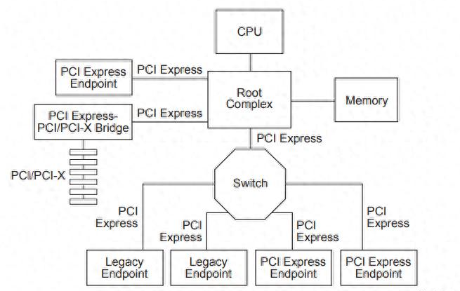

# PCIe组网图

# Root Complex

在PCIe架构中，RC（Root Complex，根复合体）是总线的起点，它负责协调和管理PCIe总线上的所有设备。RC通过PCIe总线连接到其他设备，如网卡、显卡、存储设备等，并与中央处理器（CPU）直接相连，以实现高速数据传输。

RC的主要功能包括以下几个方面：

* 配置和初始化：RC负责识别和记录每个设备的信息，包括设备类型、厂商ID、设备ID等，并协调和管理PCIe总线上的所有设备。
* 管理数据流：RC管理PCIe总线上的数据流，包括流量控制、分配带宽、错误检测和纠正等。
* 接口转换：RC可以支持不同的PCIe规范和速度。
* 管理层次结构：根复合体支持多个PCIe端口，每个端口定义了一个独立的层次结构域。

# Switch

Switch类似于网络交换机的角色，可以连接多个PCIe设备，并允许它们之间进行高速数据传输。
