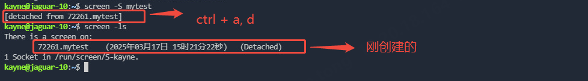

GNU screen是一款由GNU开发的用于命令行终端切换的软件。用户可以通过该软件连接多个本地或远程的命令行会话。只要screen本身没有终止，在其内部运行的会话都可以恢复。这一点对于远程登录的用户特别有用—即使网络连接中断，用户也不会失去对已经打开的命令行会话的控制。只要再次登录到主机上执行screen -r就可以恢复会话的运行。常用的screen命令如下：

| **命令**                  | **功能**                              |
| ------------------------------- | ------------------------------------------- |
| screen -S                       | 创建一个名为name的新会话                    |
| ctrl + a, d                     | 退出（detached）当前会话                    |
| screen -ls                      | 查看所有的screen会话                        |
| screen -r `<session>`         | 恢复会话，session可以通过screen -ls查询得到 |
| screen -X -S `<session> `quit | 关闭会话                                    |
| screen -dm `<session>`        | 创建但不切换到（attach）会话，比较常用      |

一个screen使用的小例子：

