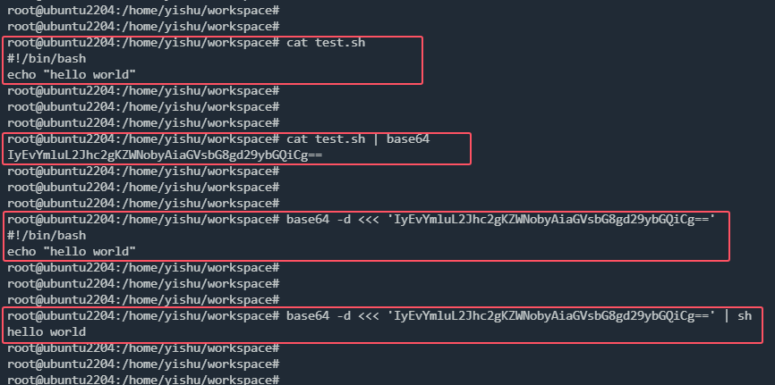

如何通过ssh批量地让远程主机执行shell脚本（前提是被执行脚本不能拷贝到远程主机上）？有两个问题要解决：

1. 如何将脚本以文本的形式传递到远程主机？
2. 如何让远程主机读取已传递的文本并执行？

对于1可以使用base64将脚本内容加密传输（本端将加密后的内容赋值给变量xxx，再将变量xxx发送到远端），待对端主机收到内容后再用base64 -d解密，然后使用sh命令读取执行（这样可以避免很多字符的转义）：



对于2可以理解为：在shell中如何将一段文本作为标准输入，直接传递给程序执行？有以下三种方法，运行结果均为：

```bash
hello
world
```

# echo + |

双引号只能传递单行文本，但支持变量替换。

单引号虽然不支持变量替换，但能传递多行文本。

```bash
var1="hello"
var2='world'

echo $var1 | cat
echo $var2 | cat

```

# << + EOF

<< + EOF 既支持变量替换，又支持多行文本。

EOF在这里只是文本开始和结束的标记，也可以换为其它字符串，如"END"。

```bash
cat << EOF
hello
world
EOF
```

# <<<

<<<比<< + EOF功能更为强大，在形式上也更为简洁。支持多行文本，双引号作变量替换，单引号不作变量替换。

```bash
var1="hello"
var2='world'

cat <<< "$var1
$var2"
```
