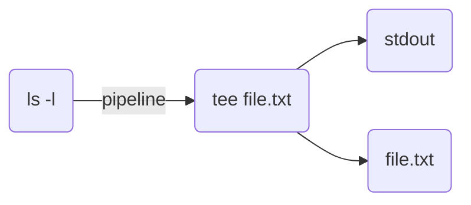

从标准输入中拷贝内容，写到标准输出或文件。需要注意的是，tee命令与重定向命令">"和">>"不同：tee不影响标准输出打印到屏幕，只是将标准输入中的内容拷贝一份到文件中，而重定向命令则是二选一，要么通过标准输出打印到屏幕，要么将内容写到文件。

# 为什么叫tee

tee 音译为字母 T，数据从左边（标准输入）流入，从右边（标准输出）和下面（文件）分流输出，字母 T 的形状很形象地说明了数据的流向，故将该命令命名为 tee。数据流向过程如下图所示：



# 命令参数

大部分版本的tee命令都包含以下参数：

**-i, --ignore-interrupts** 忽略中断信号

**-a, --append** 追加内容到文件中，类似与">>追加"命令，而不是">"覆盖命令

# 使用示例

1、输出到屏幕

```bash
ls -l | tee
```

2、同时输出到屏幕和文件

```bash
ls -l | tee xxx.txt
```

3、从标准输入读取内容并写到标准输出

```bash
# tee
hello
hello
world
world
^C
```
