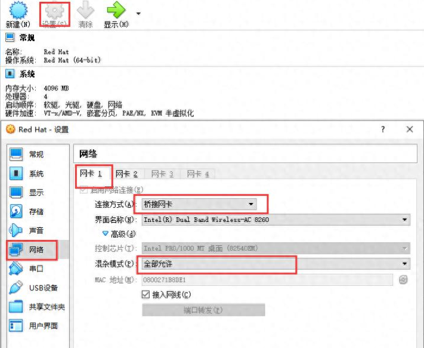
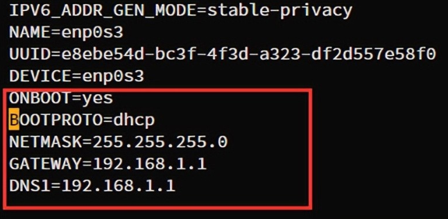
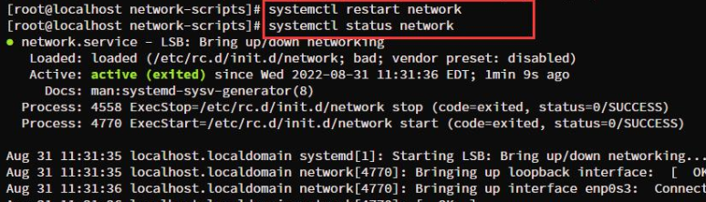
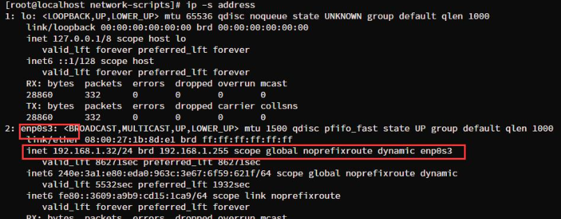
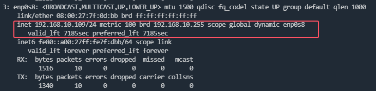
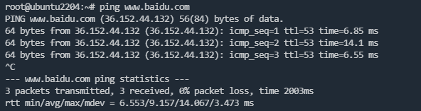

一个使用VirtualBox拉起的Linux虚机，是无法使用Internet直接上网的，因为用于上网的网卡没有分配IP地址。为了解决联网问题，我们可以使用家里路由器的DHCP功能，给虚机动态分配IP。

# 虚机网卡选择桥接模式

在VirtualBox界面上点击"设置"->"网络"->"网卡1"。连接方式选择"桥接网卡"，界面名称选择电脑的无线网卡 "Intel(R) Dual Band Wireless-AC 8260"，"高级"标签展开后，"混杂模式"选择全部允许，勾选"接入网线"。

桥接模式，是指虚机和宿主机在网络中处于同等地位，二者挂在同一个网桥上（我这里的网桥可以理解为家里的路由器）。路由器可以动态为宿主机分配IP，同理也可以为虚机分配动态IP。



# Red Hat系列配置(enp0s3)

1、编辑虚机网卡配置文件，这里为`/etc/sysconfig/network-scripts/ifcfg-enp0s3`，其中onboot为启动时是否初始化网卡配置，bootproto为使用的协议类型，netmask为子网掩码，gateway为网关，DNS1为域名解析服务器



2、`systemctl restart network`重启网络服务，或`reboot`使配置生效



3、`ip -s address`查看网卡的IP地址



# Ubuntu系列配置(enp0s8)

1、编辑虚机网卡配置文件，这里为`/etc/netplan/50-cloud-init.yaml`，新增网卡配置`enp0s8`：

```yaml
network:
    ethernets:
        enp0s3:
            dhcp4: true
        enp0s8:
            dhcp4: true
    version: 2
```

2、编辑初始化配置文件`/etc/cloud/cloud.cfg.d/50-disable-network-config.cfg`，并写入以下配置：

```bash
network: {config: disabled}
```

创建该文件的目的是为了持久化网卡配置，虚机每次`reboot`时不再从数据源获取信息覆盖`50-cloud-init.yaml`配置，而是使用现有的`50-cloud-init.yaml`配置。

3、使用`netplan apply`应用已修改的配置，或`reboot`重启使配置生效

4、`ip -s address`查看网卡的IP地址



# 尝试PING www.baidu.com

此时虚机已经具备上网功能，可以看到已经能ping通百度的网址了。


