VScode + git插件可以说是开发过程中的利器，可视化的界面 + 高效的仓库管理，让代码的开发流程更加简洁、方便。VScode每个图形化界面的操作，都有git命令与之对应。在进行图形化界面操作的同时，可以打开控制台查看输出，这样就能明白以下两个问题：VScode究竟使用了哪些git命令？这些命令又是如何使用的？

# 暂存代码（相当于git add命令）

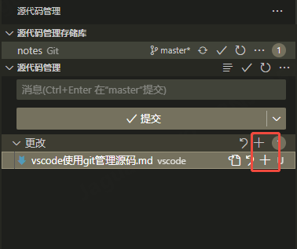

# 取消暂存（相当于git reset HEAD^ --mixed命令）

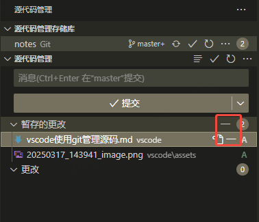

# 提交代码（相当于git commit命令）

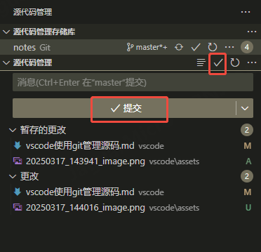

# 撤销提交（相当于git reset HEAD^ --soft命令）

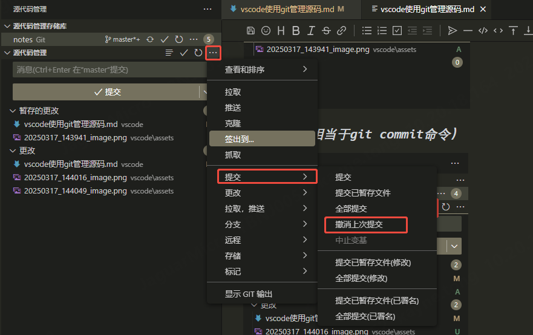

# 储藏修改（相当于git stash命令）

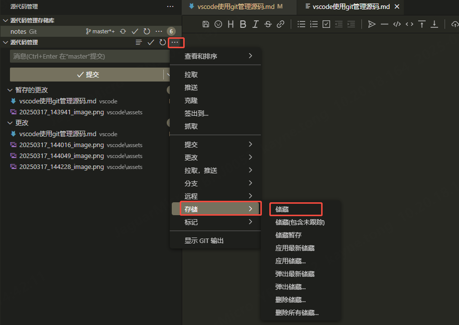

# 弹出储藏（相当于git stash pop命令）

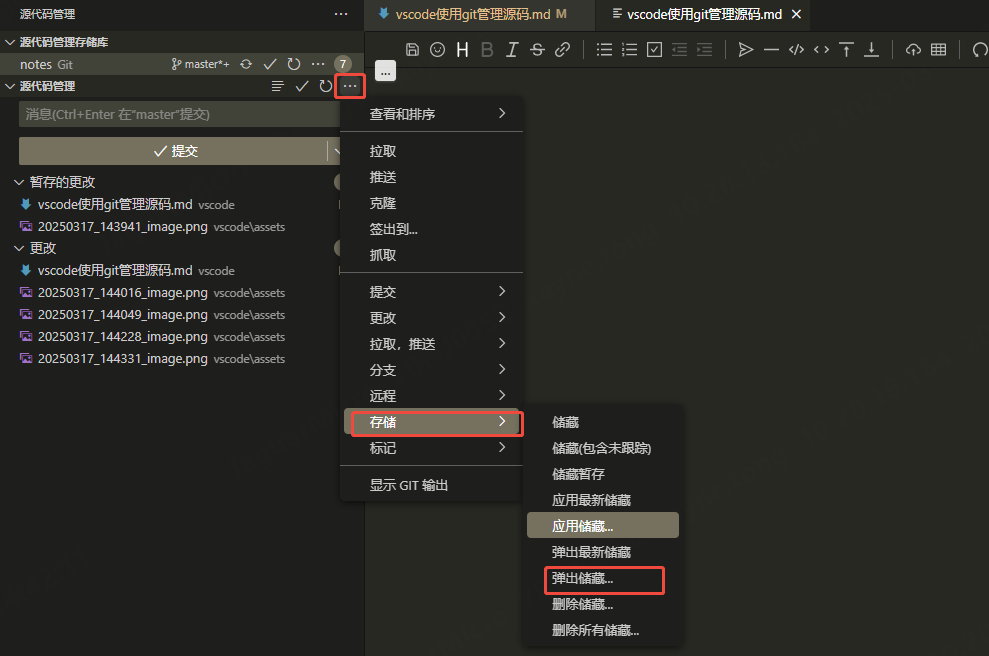

# 拉取代码（相当于git pull命令）

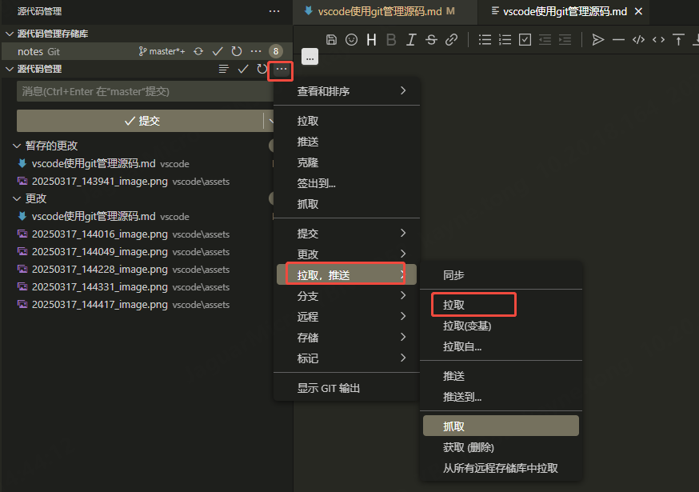

# 推送代码（相当于git push命令）

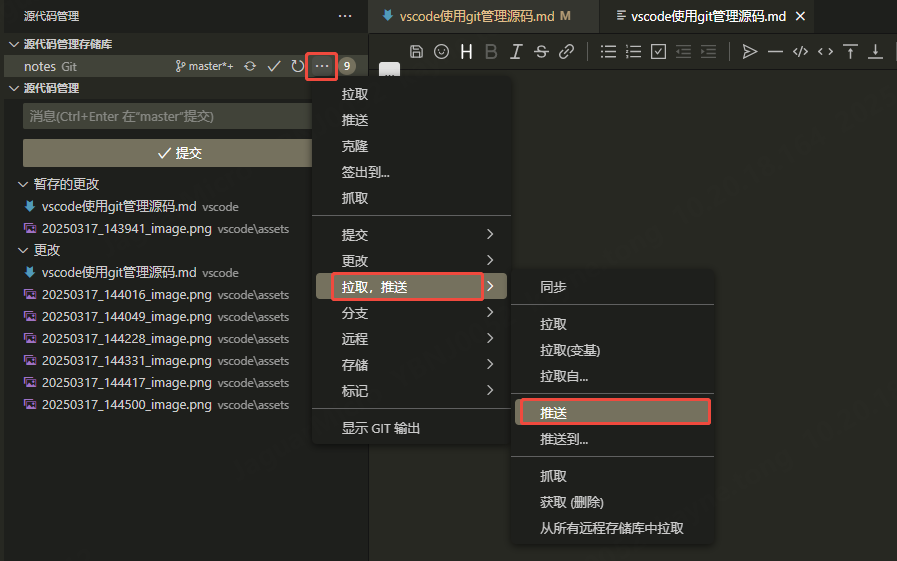

# 创建分支（相当于git branch命令）

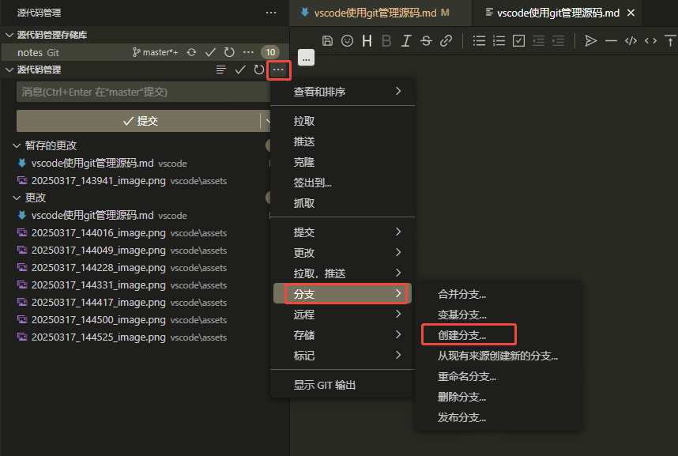

# 签出分支（相当于git checkout命令）

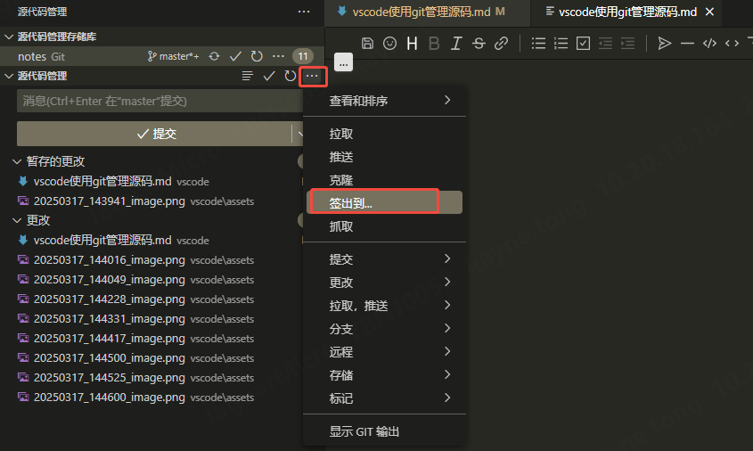

# 查看修改（相当于git show + git diff命令）

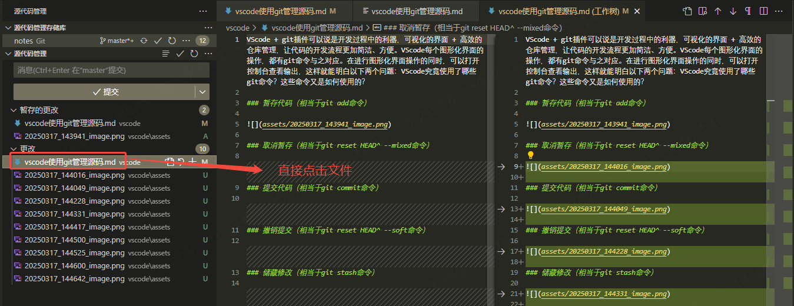
