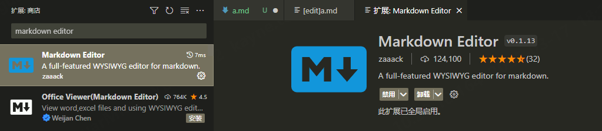
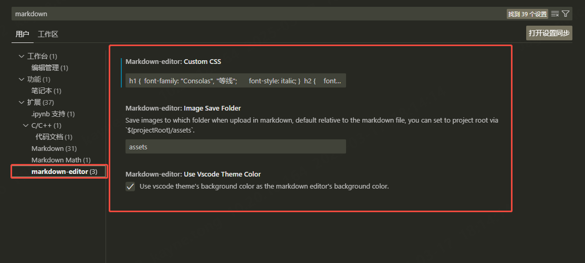
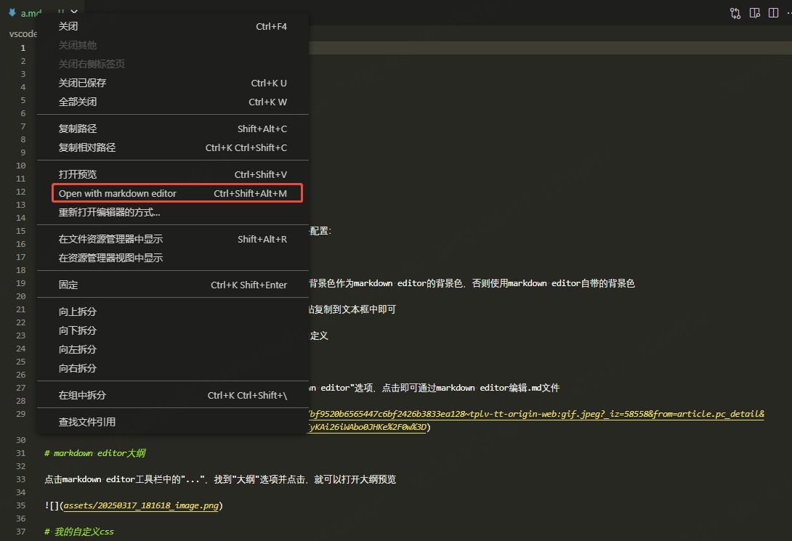
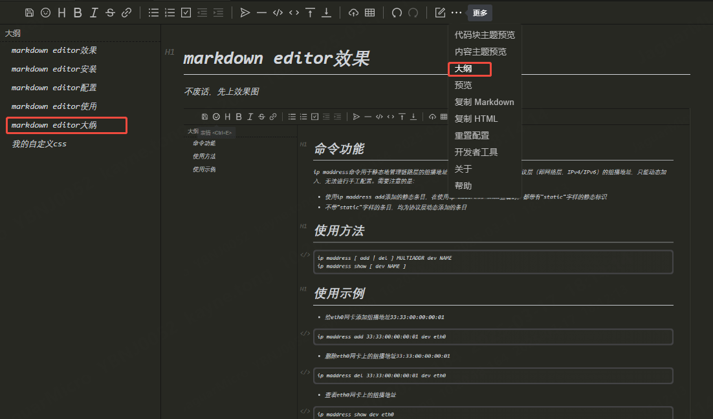
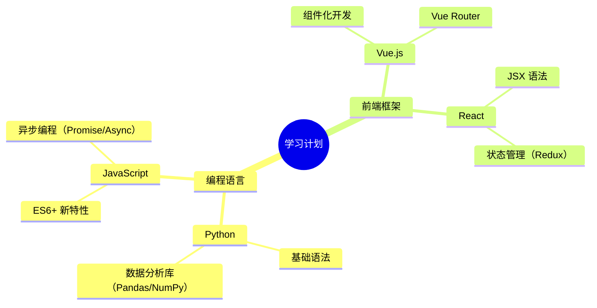
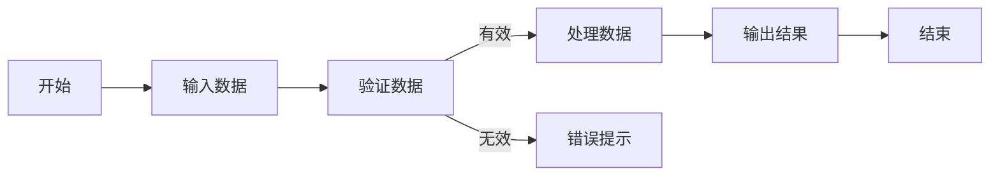
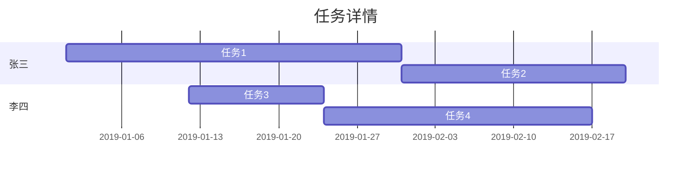
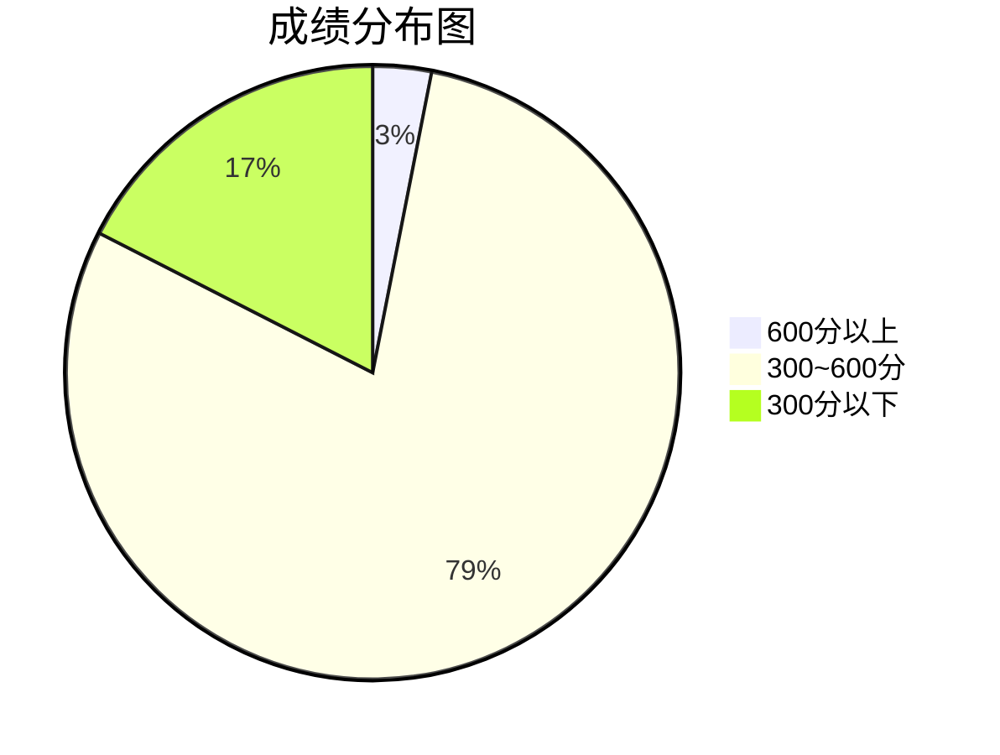
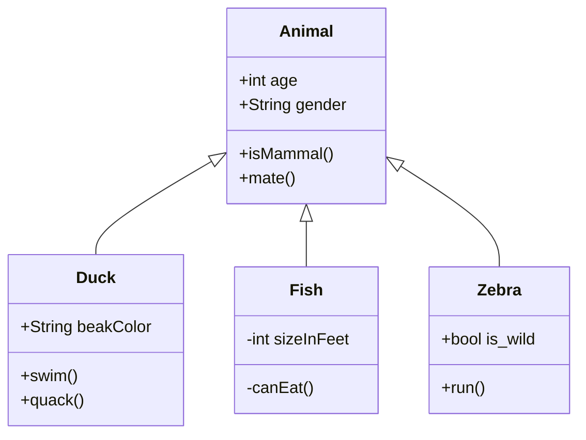
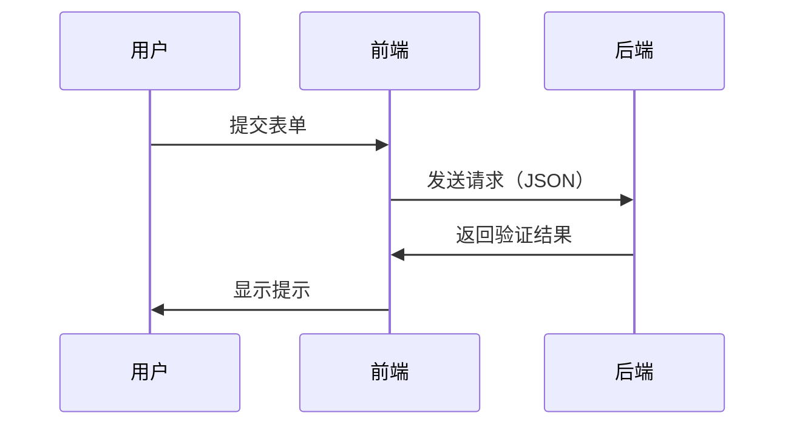

# markdown editor介绍

markdown editor是基于[vditor](https://github.com/Vanessa219/vditor)实现的一个vscode插件。支持以下特性：

- 所见即所得（WYSIWYG, What you see is what you get）
- vscode编辑器与网页视图之间的更改自动同步
- 复制Markdown/HTML内容
- 上传/粘贴/拖放的图片将自动保存到资源文件夹
- 多主题支持
- 快捷键功能
- 多种编辑模式：即时渲染模式/所见即所得模式/分屏模式
- Markdown 扩展功能
- 支持多种图表，包括KaTeX/Mermaid/Graphviz/ECharts/abc.js

# markdown editor安装

在vscode扩展中搜索"markdown editor"，找到以下图标并安装：



# markdown editor配置

打开vscode的设置，搜索"markdown editor"，找到该插件的三条配置：



1、**Use Vscode Theme Color** ：勾选表示使用vscode的主题背景色作为markdown editor的背景色，否则使用markdown editor自带的背景色

2、**Custom CSS** ：使用自定义的css样式，直接将css代码粘贴复制到文本框中即可

3、**Image Save Folder** ：图片文件的保存目录，允许用户自定义

# markdown editor使用

在vscode中找到要打开的.md文件，右击找到"Open with markdown editor"选项，点击即可通过markdown editor编辑.md文件



# markdown editor大纲

点击markdown editor工具栏中的"..."，找到"大纲"选项并点击，就可以打开大纲预览



# markdown editor图表

markdown editor支持多种图表，包括KaTeX/Mermaid/Graphviz/ECharts/abc.js等。这里着重介绍vditor内部集成的[mermaid](https://mermaid.nodejs.cn)。mermaid版本为 `8.8.0`，支持思维导图/流程图/甘特图/饼图/类图/时序图等多种图表，示例如下：

- 思维导图



- 流程图



- 甘特图



- 饼图



- 类图



- 时序图



# 我的自定义css

这里给出的我自定义的css样式：

```css
h1 {
	font-family: "Consolas", "等线";
	font-style: italic;
}

h2 {
	font-family: "Consolas", "等线";
	font-style: italic;
}

h3 {
	font-family: "Consolas", "等线";
	font-style: italic;
}

h4 {
	font-family: "Consolas", "等线";
	font-style: italic;
}

h5 {
	font-family: "Consolas", "等线";
	font-style: italic;
}

h6 {
	font-family: "Consolas", "等线";
	font-style: italic;
}

body {
	font-family: "Consolas", "等线";
	font-style: italic;
}

li {
	font-family: "Consolas", "等线";
	font-size: 0.8rem;
}

pre {
	border-radius: 0.375rem;
	font-size: 0.98rem;
}

p {
	line-height: 1.5;
	font-size: 0.8rem;
}

a {
	text-decoration: none;
	font-size: 0.8rem;
}

ul {
	padding-left: 2rem;
	font-size: 0.8rem;
}

ol {
	padding-left: 2rem;
	font-size: 0.8rem;
}

table {
	border-radius: 0.375rem;
	font-size: 0.8rem;
}

blockquote {
	color: #6a737d;
	padding: 0 1rem;
	margin-left: 0;
	margin-right: 0;
	border-left: 0.25rem solid #dfe2e5;
	font-size: 0.8rem;
}
```
