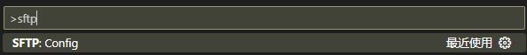

VScode SFTP插件最亮眼的功能，就是Ctrl + S自动保存本地文件到远端。

# 下载并安装SFTP插件

扩展商店里面搜索"sftp"，点击"安装"。


# 配置SFTP

按下"F1"并输入"sftp"，点击"SFTP:Config"进行配置。



"host"、"protocol"、"port"、"username"、"password"、"remotePath"、"uploadOnSave"为必填字段。

"remotePath"代表映射的远程目录；

"uploadOnSave"为true表示，当按下Ctrl + S保存文件后，文件会被上传远程服务器。

```json
{
	"name": "My Server",
	"host": "192.168.56.102",
	"protocol": "sftp",
	"port": 22,
	"username": "root",
	"password": "root",
	"remotePath": "/home/workspace/",
	"uploadOnSave": true,
	"useTempFile": false,
	"openSsh": false
}
```

# 验证SFTP插件生效

配置好SFTP插件后，在工作目录下新建一个test.txt文件，编辑内容并保存，文件会被传输到远程服务器。

查看远程服务器，有对应的文件：

```bash
[root@192 ~]# cd /home/workspace/  
[root@192 workspace]# ll  
total 4  
-rw-r--r--. 1 root root 20 Oct 6 2022 test.txt  
[root@192 workspace]# cat test.txt  
this sftp test file!
[root@192 workspace]#  
```

# SFTP的其它功能

除了"uploadOnSave"功能之外，选中本地的文件右击，还会出现以下功能：

- "Diff with Remote" 将本地文件与远程文件的修改进行对比
- "Upload" 进行文件的上传
- "Download" 下载远程文件至本地
