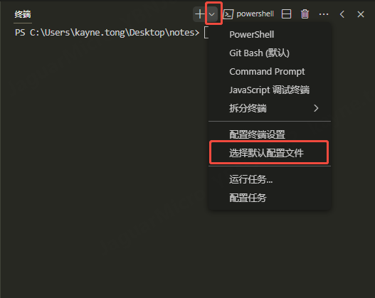
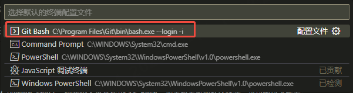
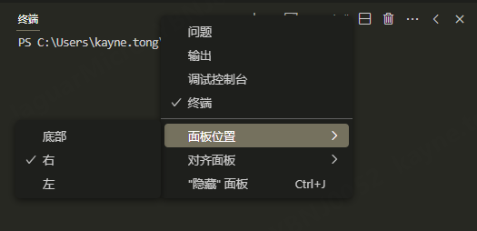

# 修改默认终端

Windows上Vscode打开的终端，默认为Power shell，但我个人更喜欢用Git Bash，如果想要改变默认终端，可以做以下配置：

1、 Ctrl + `打开终端，点击 "+" 后的下拉框，点击"选择默认配置文件"

2、 此时会在上方的搜索框内跳出几个常用的终端，选择"Git Bash"即可

再通过ctrl + `打开终端，默认就会弹出Git bash而不是Power shell。

# 更改终端位置

Windows上Vscode的打开的终端，默认位于屏幕下方，但我个人更喜欢将其放在右侧，如果想要改变终端的默认位置，可以做以下配置：

1、 Ctrl + `打开终端

2、 右击终端的空白处（不是Vscode界面的空白处），找到"面板位置"选项

3、 将光标放在"面板位置"上，即可出现"底部"、"右"、"左"三个选项，勾选"右"即可

再通过ctrl + `打开终端，终端就会默认出现在右侧，而不是下方。
