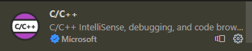
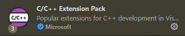
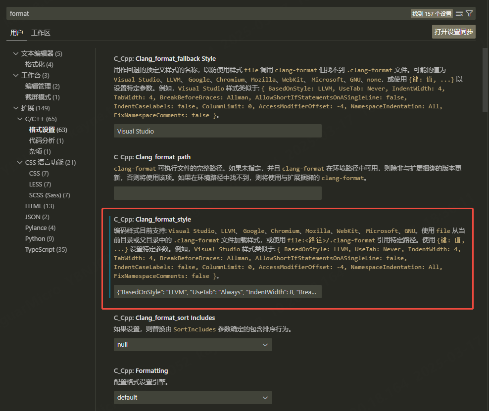

# 插件安装及配置

VScode的c/c++插件自带clang-format功能，无需额外下载clang-format插件（二者安装其一即可）。clang-format的功能是格式化代码（指定代码的排版风格）。在Vscode中，可以使用"**Alt + Shift + F**"格式化c/c++代码。需要下载的插件如下：





c/c++插件默认使用的Style是Virtual Studio，也可以自定义代码风格，如下所示：



1、"Ctrl + ,"打开VScode的"设置"面板

2、在搜索框搜索"format"关键字

3、在搜索的结果中找到"C/C++"标签下的"格式设置"选项

4、找到"C_Cpp: Clang_format_style"配置

5、参照VScode给出的示例编写自己的format_style

# 我的json配置

我的配置如下，两种使用方法：

1、将其粘贴至file处即可直接使用

2、也可以将其保存至文件中，在file处指明文件的路径

```json
{
	"BasedOnStyle": "LLVM",
	"UseTab": "Always",
	"IndentWidth": 8,
	"BreakBeforeBraces": "Linux",
	"AllowShortIfStatementsOnASingleLine": false,
	"AllowShortFunctionsOnASingleLine": false,
	"AlignAfterOpenBracket": "Align",
	"IndentCaseLabels": false,
	"ColumnLimit": 100
}
```

各字段的含义如下：

* **BaseOnStyle** ：以某种format-style为基础进行修改，可选的有LLVM，Virtual Studio，WebKit等
* **UseTab** ：是否使用tab制表符

* **IndentWidth** ：缩进宽度
* **TabWidth** ：Tab宽度（一个Tab等于多少个空格）

* **BreakBeforeBraces** ：大括号的换行风格，可选的值有Linux，Attach，Allman，Mozilla，GNU，WebKit等（Linux为function/struct换行，if/while等语句不换行）
* **AllowShortIfStatementsOnASingleLine** ：是否允许短的if语句一行显示

* **AllowShortFunctionsOnASingleLine** ：是否允许短的函数一行显示
* **IndentCaseLables** ：case语句是否缩进

* **ColumnLimit** ：行宽限制，即每行最多多少个字符
