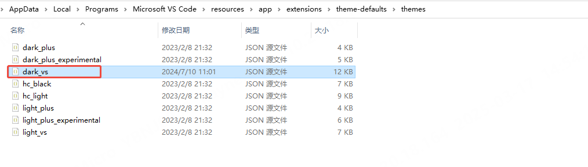
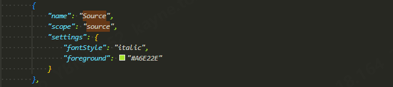
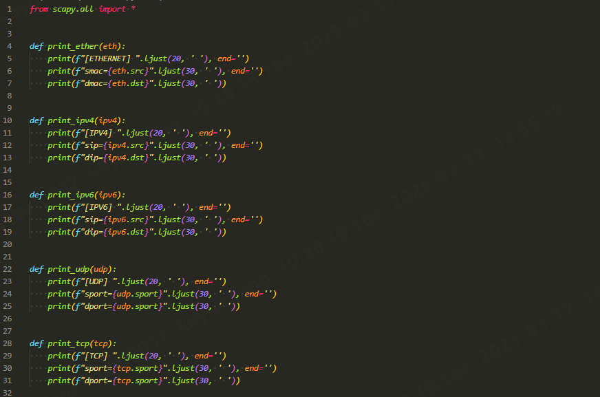
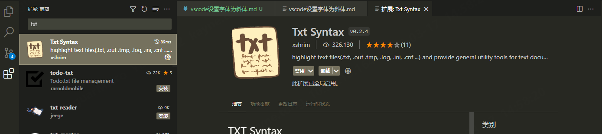

vscode支持配置所有源文件（包括txt文件）的字体为斜体，操作步骤如下：

1、在vscode的安装目录下找到对应主题的json文件。比如我的vscode的主题为"深色+"，该主题的配置文件位于："Microsoft VS Code\resources\app\extensions\theme-defaults\themes\dark_vs.json"

2、在"tokenColors"中加入以下配置，该配置会将所有的源码都以斜体显示（包括c/c++/python/java/lua等）

3、重启vscode配置即可生效，配置成功后的效果如下

4、如果想将txt/log/ini/cnf等文本文件的内容显示为斜体，需要安装"TXT Syntax"插件。原理：安装"TXT Syntax"插件后，vsocde会自动将txt/log/ini/cnf等文本文件当作源码处理，即步骤2中的source配置会生效; 如果不安装则不会生效。

